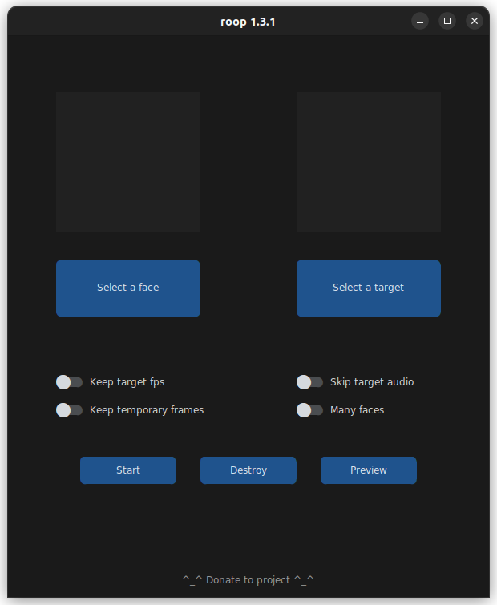

# Roop 

Face swap videos and images.

## Install

First time launching? Install first: [install](install.json)

## Run

Run the [launch.json](launch.json) script to run roop: 

See [docs](https://github.com/s0md3v/roop) for additional usage details.
